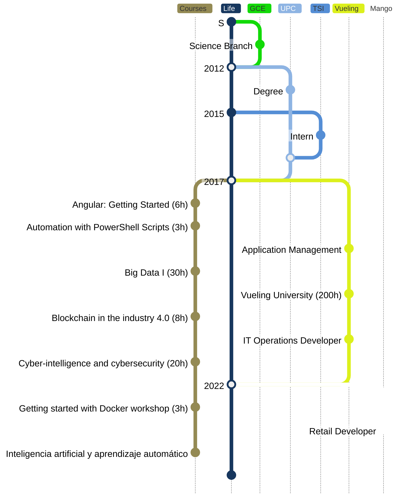

### ***07/2022 - Today || Retail Developer***
#### ___Mango (Scalian)___
- Develop Windows Services solutions in .NET
- Automate manual repetitive tasks
- Fiscal printer integrations as well as TEF Ingenico new payment system
_______

### ***04/2019 - 07/2022 || IT Operations Developer***
#### ___Vueling Airlines (Aktios)___
- Develop API solutions in .NET Framework
- Automate manual processes with Azure
DevOps’ pipelines and custom applications
_______

### ***09/2017 - 04/2019 || Application Management***
#### ___Vueling Airlines (Aktios)___
- Application management applied to
different technologies as Siebel or .NET
Framework
- Data extractions on T-SQL
- PowerShell scripting
- Client support and project requirements
- Vueling University (200h)
_______

### ***09/2012 - 09/2017 || Degree in Informatics Engineering***
#### ___EPSEVG Universitat Politècnica de Catalunya___
_______

### ***01/2015 - 09/2017 || Intern Developer***
#### ___Telemàtic Solucions Informàtiques S.L.___
- Develop Window Services solutions in .NET
Framework to avoid repetitive tasks
extracting data from database like A3Erp or
Sage
- Multiple meetings with the client to define
functionalities
_______

### ***09/2010 - 06/2012 || GCE - science branch***
#### ___IES Manuel de Cabanyes___
_______

### ***Courses***
<ul>
<li>Inteligencia artificial y aprendizaje automático (30h)</li>
<li>Getting started with Docker workshop (3h)</li>
<li>Cyber-intelligence and cybersecurity (20h)</li>
<li>Blockchain in the industry 4.0 (8h)</li>
<li>Big Data I (30h)</li>
<li>Automation with PowerShell Scripts (3h)</li>
<li>Angular: Getting Started (6h)</li>
</ul>
